<h1 align="center">
   
  Projeto Automação
</h1>

Este projeto desempenha um papel vital ao preservar a integridade de dois sistemas por meio de testes rigorosos via Web e API. Ao empregar Python como linguagem principal e Selenium e Zeep como ferramentas-chave, a automação simula interações simples e complexas realizadas por usuários em operações cotidianas.
  
A escolha do Python garante uma codificação eficiente e flexível, enquanto o Selenium, ao emular um navegador, reproduz fielmente o comportamento do usuário e Zeep cria toda a interface SOAP para validar o comportamento da API dos sistemas.
  
Isso permite a detecção precoce de falhas, aprimorando a experiência do usuário final e assegurando a estabilidade do sistema. Esse processo de teste meticuloso é essencial para identificar possíveis problemas e garantir que os padrões de funcionamento sejam mantidos, proporcionando assim um ambiente digital mais confiável e eficaz.
  
**OBS: a arquitetura aqui presente, bem como o relatório de exemplo são estruturas reais, mas que por motivos de sigilo comercial tiveram seus dados alterados, de modo que seja perfeitamente possível entender o que foi feito sem comprometer as informações reais validadas.**

 

## Stack

 

## Arquitetura

Construído com a estrutura em classes do Unittest - biblioteca padrão do Python para testes - e executado com Pytest de forma paralela - quando há intenção de validar os ambientes - o Projeto Automação uniu o melhor dos dois mundos: a organização da POO do Unittest com a performance de execução do Pytest.

Cada `__init__.py` inicializa uma nova classe-base para os sub-diretórios abaixo dela, possibilitando que cada módulo tenha acesso às ferramentas necessárias conforme determinado pelo princípio S.O.L.I.D (mais especificamente O - Open/Closed Principle: objetos ou entidades devem estar abertos para extensão, mas fechados para modificação - e I - Interface Segregation Principle: uma classe não deve ser forçada a implementar interfaces e métodos que não utilizará).

O `__init__.py` na raíz do diretório de testes é o maior e, possivelmente, mais complexo, pois nele é implementada a maior parte das funcionalidades e lógicas, funções gerais e a classe-mor `BaseTestCase(unittest.TestCase)`, de onde **todos** os testes derivam, como demonstrado a seguir:

Com a estrutura demonstrada acima, deve-se imaginar que a cada nível que a estrutura se aprofunda, mais específicas são as classes, comportamento decorrente de suas implementações onde comportamentos comuns entre mais classes são definidos em classes mais ao centro, enquanto elementos mais específicos se definem em classes mais periféricas.

Através das implementações de métricas presentes na classe `BaseTestCase` nos métodos `setUpClass` e `tearDownClass` - ambos decorados com `@classmethod` - e própria execução dos testes registra as métricas definidas, sendo elas `name`, `type`, `path`, `methods_count`, `duration`, `readable` e `manual_exec`, conforme indicado abaixo:

| Métrica         | Tipo                    | Descrição
| :---            | :---                    | :---
| `name`          | `str`                   | Nome da classe dentro do programa   `ExemploTestCase -> ExemploTestCase(...)`
| `type`          | `Literal["Web", "API"]` | Tipo de teste realizado, Web ou API   `"Web" \| "API"`
| `path`          | `str`                   | Caminho do dir raíz até o teste   `test.test_api.abc.ExemploTestCase`
| `methods_count` | `int`                   | Quantidade de cenários dentro do caso de teste
| `duration`      | `float`                 | Duração do tempo de execução da classe   medido em segundos
| `readable`      | `str`                   | Nome "human-readable" da classe, como   estará no relatório final
| `manual_exec`   | `int`                   | Tempo de execução do exato mesmo caso com   mesmos cenários e condições, manualmente

**Acesse o [Relatório de Execução - Testes Automatizados](https://lucasgoncsilva.github.io/projeto_automacao/report.html) para ver em detalhes o resultado obtido a partir das métricas observadas e quais tipos de informações são encontradas lá.**

 

## Licença

This project is under [MPLv2 - Mozilla Public License Version 2.0](https://choosealicense.com/licenses/mpl-2.0/). Permissions of this weak copyleft license are conditioned on making available source code of licensed files and modifications of those files under the same license (or in certain cases, one of the GNU licenses). Copyright and license notices must be preserved. Contributors provide an express grant of patent rights. However, a larger work using the licensed work may be distributed under different terms and without source code for files added in the larger work.
